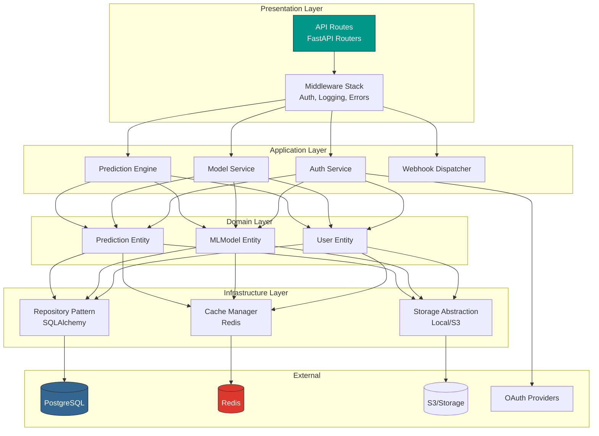
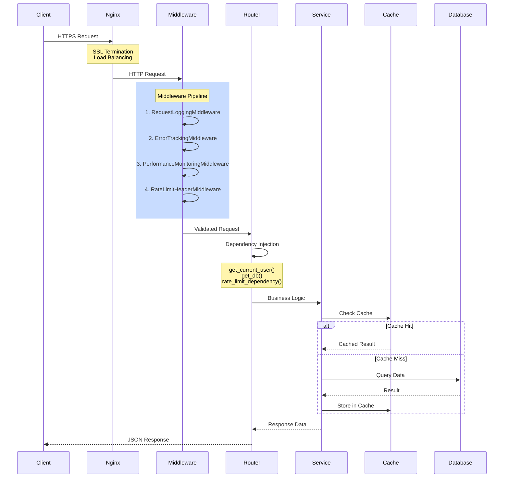
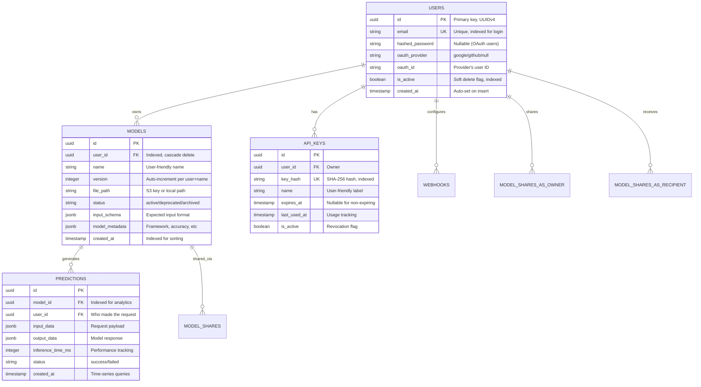
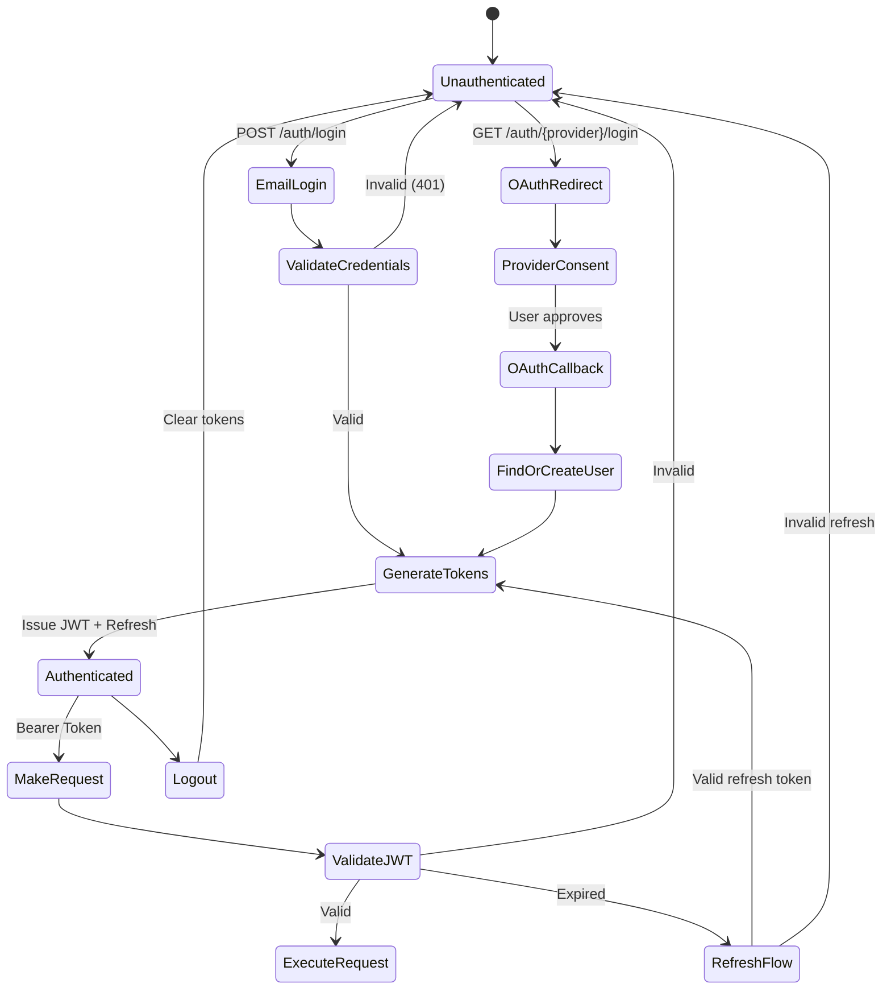

<div align="center">

# 🐍 InferX Backend

### **Production-Grade ML Model Serving API**

*A high-performance, scalable REST API built with FastAPI for deploying and serving machine learning models*

<br/>


<br/>

[**🏗️ System Design**](#️-system-design) •
[**🔐 Security**](#-security-deep-dive) •
[**🧠 Problem Solving**](#-problem-solving--trade-offs) •
[**📚 API Reference**](#-api-reference)

</div>

---

## 🎯 Engineering Highlights

This backend demonstrates proficiency in **production-ready API development**:

<table>
<tr>
<td align="center" width="20%">

<br/><b>System Design</b>
<br/><sub>Scalable architecture</sub>
<br/><sub>Layered separation</sub>
</td>
<td align="center" width="20%">

<br/><b>Security</b>
<br/><sub>Defense in depth</sub>
<br/><sub>OWASP compliant</sub>
</td>
<td align="center" width="20%">

<br/><b>Performance</b>
<br/><sub>~2ms cached inference</sub>
<br/><sub>LRU model caching</sub>
</td>
<td align="center" width="20%">

<br/><b>Testing</b>
<br/><sub>77% test coverage</sub>
<br/><sub>39 automated tests</sub>
</td>
<td align="center" width="20%">

<br/><b>Problem Solving</b>
<br/><sub>Documented trade-offs</sub>
<br/><sub>Edge case handling</sub>
</td>
</tr>
</table>

---

## 🏗️ System Design

### High-Level Architecture

This system follows a **layered architecture** pattern with clear separation of concerns:



### Design Decisions & Rationale

| Decision | Why | Trade-off |
|----------|-----|-----------|
| **Monolith over Microservices** | Single team, faster iteration, simpler deployment | Limited to vertical scaling (acceptable at current scale) |
| **PostgreSQL over NoSQL** | Strong consistency for financial data, complex queries for analytics | Less horizontal scalability (mitigated with read replicas) |
| **Redis for both cache & rate limiting** | Reduce operational complexity, single source of truth | Single point of failure (mitigated with Redis Sentinel) |
| **File storage abstraction** | Easy migration from local to S3 | Slight overhead in abstraction layer |
| **Synchronous inference** | Simpler request/response model | Can't handle long-running models (would need async workers) |

### Request Flow & Lifecycle



### Database Schema Design



**Indexing Strategy:**
- `users.email` — Unique index for O(1) login lookup
- `models(user_id, name, version)` — Composite unique for versioning
- `predictions(model_id, created_at)` — Time-series analytics queries
- `api_keys.key_hash` — Fast API key validation

---

## 🔐 Security Deep Dive

### Defense in Depth Strategy

```
┌─────────────────────────────────────────────────────────────────┐
│ Layer 1: Network Security                                        │
│ • TLS 1.3 encryption (Nginx)                                    │
│ • CORS whitelist                                                 │
│ • Rate limiting (100/min per user)                              │
└─────────────────────────────────────────────────────────────────┘
                              │
                              ▼
┌─────────────────────────────────────────────────────────────────┐
│ Layer 2: Authentication                                          │
│ • JWT tokens (HS256, 30min expiry)                              │
│ • API Keys (SHA-256 hashed)                                     │
│ • OAuth 2.0 (Google, GitHub)                                    │
│ • Refresh token rotation                                         │
└─────────────────────────────────────────────────────────────────┘
                              │
                              ▼
┌─────────────────────────────────────────────────────────────────┐
│ Layer 3: Authorization                                           │
│ • Role-based access (user/admin)                                │
│ • Resource ownership validation                                  │
│ • Model sharing permissions (view/use/edit)                     │
└─────────────────────────────────────────────────────────────────┘
                              │
                              ▼
┌─────────────────────────────────────────────────────────────────┐
│ Layer 4: Input Validation                                        │
│ • Pydantic schema validation                                    │
│ • File type/size restrictions                                   │
│ • SQL injection prevention (ORM)                                │
└─────────────────────────────────────────────────────────────────┘
                              │
                              ▼
┌─────────────────────────────────────────────────────────────────┐
│ Layer 5: Data Protection                                         │
│ • Argon2 password hashing                                       │
│ • Sensitive data encryption at rest                             │
│ • Audit logging                                                  │
└─────────────────────────────────────────────────────────────────┘
```

### Authentication Flow



### Password Security: Why Argon2?

**Problem:** Bcrypt is vulnerable to GPU-based attacks (10 billion attempts/sec on modern GPUs).

**Solution:** Argon2 (Password Hashing Competition winner)

```python
# Memory-hard: Requires 64MB RAM per hash attempt
# Time-hard: Configurable iteration count
# Parallelism: Can utilize multiple CPU cores

pwd_context = CryptContext(
    schemes=["argon2", "bcrypt"],  # Argon2 primary, bcrypt fallback
    deprecated="auto"
)

# Argon2 parameters (secure defaults)
# - memory_cost: 65536 KB (64 MB)
# - time_cost: 3 iterations
# - parallelism: 4 threads
```

**Attack resistance:**
| Algorithm | GPU Attack Speed | Memory Required |
|-----------|------------------|-----------------|
| MD5 | 40 billion/sec | 0 MB |
| bcrypt | 100,000/sec | 4 KB |
| **Argon2** | **10/sec** | **64 MB per attempt** |

### API Key Security

**Problem:** API keys must be stored but also validated quickly.

**Solution:** One-way hash with constant-time comparison

```python
# Key generation (shown once to user)
raw_key = secrets.token_urlsafe(32)  # 256-bit entropy

# Storage (only hash stored in DB)
key_hash = hashlib.sha256(raw_key.encode()).hexdigest()

# Validation (constant-time to prevent timing attacks)
def validate_api_key(provided_key: str, stored_hash: str) -> bool:
    provided_hash = hashlib.sha256(provided_key.encode()).hexdigest()
    return secrets.compare_digest(provided_hash, stored_hash)
```

### Rate Limiting: Token Bucket Algorithm

**Problem:** Prevent abuse while allowing legitimate burst traffic.

**Solution:** Sliding window with Redis sorted sets

```python
async def check_rate_limit(self, key: str, max_requests: int, window: int):
    """
    Sliding window rate limiter using Redis sorted sets
    
    Time Complexity: O(log N) for ZADD, O(log N) for ZRANGEBYSCORE
    Space Complexity: O(N) where N = requests in window
    """
    now = time.time()
    window_start = now - window
    
    pipe = self.redis.pipeline()
    
    # Remove expired entries (outside window)
    pipe.zremrangebyscore(key, 0, window_start)
    
    # Count requests in current window
    pipe.zcard(key)
    
    # Add current request with timestamp as score
    pipe.zadd(key, {str(now): now})
    
    # Set TTL to auto-cleanup
    pipe.expire(key, window)
    
    _, request_count, _, _ = pipe.execute()
    
    return request_count <= max_requests
```

**Why sliding window over fixed window?**
- Fixed window: User can make 200 requests at window boundary (100 at 0:59, 100 at 1:00)
- Sliding window: Consistent enforcement, no boundary exploitation

---

## 🧠 Problem Solving & Trade-offs

### Problem 1: Cold Start Latency for ML Models

**Challenge:** Loading a 50MB sklearn model from disk takes ~200ms, unacceptable for real-time APIs.

**Solution:** LRU (Least Recently Used) in-memory cache

```python
class ModelLoader:
    def __init__(self, cache_size: int = 5):
        self.cache_size = cache_size
        self._cache: OrderedDict[str, Any] = OrderedDict()
    
    async def load_model(self, model_id: str, file_path: str) -> Any:
        # O(1) cache lookup
        if model_id in self._cache:
            # Move to end (most recently used)
            self._cache.move_to_end(model_id)
            return self._cache[model_id]  # ~2ms
        
        # Cache miss: load from storage (~200ms)
        model = await self._load_from_storage(file_path)
        
        # LRU eviction if cache is full
        if len(self._cache) >= self.cache_size:
            self._cache.popitem(last=False)  # Remove oldest
        
        self._cache[model_id] = model
        return model
```

**Trade-off Analysis:**
| Approach | Latency | Memory | Complexity |
|----------|---------|--------|------------|
| No cache | 200ms | 0 | Simple |
| **LRU cache (chosen)** | **2ms** | **~250MB** | **Moderate** |
| Redis serialization | 50ms | External | High (serialization overhead) |
| Memory-mapped files | 100ms | OS-managed | High (platform-specific) |

**Decision:** LRU cache balances latency and memory. 5 models × 50MB = 250MB is acceptable.

---

### Problem 2: Handling Model Versioning Without Breaking Clients

**Challenge:** Users update models frequently. How to keep old versions accessible?

**Solution:** Auto-incrementing versions with unique constraint

```python
# Database constraint
UniqueConstraint('user_id', 'name', 'version', name='unique_user_model_version')

# Auto-versioning logic
def get_next_version(db: Session, user_id: str, model_name: str) -> int:
    result = db.query(func.max(Model.version)).filter(
        Model.user_id == user_id,
        Model.name == model_name
    ).scalar()
    return (result or 0) + 1

# Version-aware prediction endpoint
@router.post("/predict/{model_id}")
async def predict(model_id: str, version: Optional[int] = None):
    if version:
        model = get_model_by_version(model_id, version)  # Specific version
    else:
        model = get_latest_active_model(model_id)  # Default: latest active
```

**Status flow:**
```
ACTIVE → DEPRECATED → ARCHIVED → (deleted)
   ↑         ↓
   └─────────┘ (rollback possible)
```

---

### Problem 3: Dual Authentication (JWT + API Keys)

**Challenge:** Dashboards use JWT, programmatic access needs API keys. Both should work seamlessly.

**Solution:** Unified dependency with fallback chain

```python
async def get_current_user(
    request: Request,
    db: Session = Depends(get_db),
    # Try JWT first, then API key
    token: Optional[str] = Depends(oauth2_scheme_optional),
    api_key: Optional[str] = Header(None, alias="X-API-Key")
) -> User:
    
    # Priority 1: JWT Bearer token
    if token:
        payload = verify_token(token)
        user_id = payload.get("sub")
        return db.query(User).filter(User.id == user_id).first()
    
    # Priority 2: API Key
    if api_key:
        key_hash = hashlib.sha256(api_key.encode()).hexdigest()
        api_key_obj = db.query(APIKey).filter(
            APIKey.key_hash == key_hash,
            APIKey.is_active == True,
            or_(APIKey.expires_at.is_(None), APIKey.expires_at > datetime.utcnow())
        ).first()
        
        if api_key_obj:
            # Update last_used_at (async, non-blocking)
            background_tasks.add_task(update_api_key_usage, api_key_obj.id)
            return api_key_obj.user
    
    raise HTTPException(status_code=401, detail="Not authenticated")
```

---

### Problem 4: Webhook Reliability

**Challenge:** External endpoints may be down. How to ensure delivery?

**Solution:** Retry with exponential backoff + HMAC signatures

```python
async def dispatch_webhook(webhook: Webhook, event: dict):
    """
    Retry strategy: 1s, 2s, 4s, 8s (max 4 retries)
    HMAC prevents replay attacks
    """
    payload = json.dumps(event)
    
    # Sign payload with webhook secret
    signature = hmac.new(
        webhook.secret.encode(),
        payload.encode(),
        hashlib.sha256
    ).hexdigest()
    
    headers = {
        "Content-Type": "application/json",
        "X-Webhook-Signature": f"sha256={signature}",
        "X-Webhook-Timestamp": str(int(time.time()))
    }
    
    for attempt in range(webhook.max_retries):
        try:
            async with httpx.AsyncClient() as client:
                response = await client.post(
                    webhook.url,
                    content=payload,
                    headers=headers,
                    timeout=webhook.timeout_seconds
                )
                
                if response.status_code < 400:
                    return  # Success
                    
        except Exception as e:
            logger.warning(f"Webhook attempt {attempt + 1} failed: {e}")
        
        # Exponential backoff
        await asyncio.sleep(2 ** attempt)
    
    # All retries failed - log for manual review
    logger.error(f"Webhook {webhook.id} failed after {webhook.max_retries} attempts")
```

---

### Problem 5: Graceful Degradation

**Challenge:** What happens when Redis is down?

**Solution:** Fail-open pattern with logging

```python
def get_rate_limiter() -> RateLimiter:
    global _rate_limiter
    
    try:
        redis_client = redis.from_url(settings.REDIS_URL)
        redis_client.ping()  # Health check
        _rate_limiter = RateLimiter(redis_client)
        
    except Exception as e:
        logger.warning(f"Redis unavailable: {e}. Rate limiting disabled.")
        
        # Return a "null" rate limiter that allows all requests
        class NullRateLimiter:
            async def check_rate_limit(self, *args) -> tuple[bool, dict]:
                return True, {"limit": "unlimited", "remaining": "unlimited"}
        
        _rate_limiter = NullRateLimiter()
    
    return _rate_limiter
```

**Philosophy:** Availability > strict rate limiting. Log the incident, alert ops, but don't break the service.

---

## 🛠️ Technology Stack

| Category | Technology | Why This Choice |
|----------|------------|-----------------|
| **Framework** | FastAPI 0.104 | Async, auto-docs, type-safe, high performance |
| **Language** | Python 3.11+ | Type hints, async/await, ecosystem |
| **Database** | PostgreSQL 15 | ACID, JSONB, battle-tested |
| **ORM** | SQLAlchemy 2.0 | Type-safe queries, migrations |
| **Cache** | Redis 7.0 | Sub-ms latency, atomic ops |
| **Auth** | python-jose + Passlib | Standard JWT + Argon2 |
| **Validation** | Pydantic 2.5 | Fast, strict validation |
| **Testing** | pytest 7.x | Fixtures, async support |

---

## 📚 API Reference

### Endpoints Overview (30+ endpoints)

| Category | Endpoints | Auth | Description |
|----------|-----------|------|-------------|
| **Auth** | 6 | Mixed | Register, login, OAuth, token refresh |
| **Models** | 5 | JWT | CRUD, upload, versioning |
| **Predictions** | 3 | JWT/API Key | Inference, history, analytics |
| **API Keys** | 4 | JWT | Create, list, revoke |
| **Sharing** | 4 | JWT | Share models, permissions |
| **Webhooks** | 5 | JWT | Configure, test, events |
| **Health** | 3 | Public | Liveness, readiness probes |

### Quick Examples

<details>
<summary><b>📦 Complete Workflow: Upload → Predict → Analyze</b></summary>

```bash
# 1. Register
curl -X POST http://localhost:8000/api/v1/auth/register \
  -H "Content-Type: application/json" \
  -d '{"email": "dev@example.com", "password": "SecurePass123!"}'

# 2. Login (get tokens)
TOKEN=$(curl -s -X POST http://localhost:8000/api/v1/auth/login \
  -H "Content-Type: application/json" \
  -d '{"email": "dev@example.com", "password": "SecurePass123!"}' \
  | jq -r '.access_token')

# 3. Upload model
MODEL_ID=$(curl -s -X POST http://localhost:8000/api/v1/models/upload \
  -H "Authorization: Bearer $TOKEN" \
  -F "file=@iris_model.pkl" \
  -F "name=iris-classifier" \
  -F "model_type=sklearn" \
  | jq -r '.id')

# 4. Make prediction (cached: ~2ms)
curl -X POST "http://localhost:8000/api/v1/predict/$MODEL_ID" \
  -H "Authorization: Bearer $TOKEN" \
  -H "Content-Type: application/json" \
  -d '{"input": [[5.1, 3.5, 1.4, 0.2]]}'

# Response:
# {
#   "prediction": [0],
#   "probabilities": [[0.97, 0.02, 0.01]],
#   "inference_time_ms": 2,
#   "cache_hit": true
# }

# 5. Get analytics
curl "http://localhost:8000/api/v1/predictions/$MODEL_ID/analytics" \
  -H "Authorization: Bearer $TOKEN"

# Response:
# {
#   "total_predictions": 1547,
#   "success_rate": 0.98,
#   "avg_inference_time_ms": 2.3,
#   "predictions_today": 142
# }
```
</details>

---

## 🧪 Testing

```bash
# Run all tests
pytest

# With coverage
pytest --cov=app --cov-report=html

# Specific module
pytest tests/test_auth.py -v
```

**Coverage: 77%** across 39 test cases

---

## 📁 Project Structure

```
Backend/
├── app/
│   ├── api/v1/           # Route handlers
│   ├── core/             # Security, config, utilities
│   ├── models/           # SQLAlchemy models
│   ├── schemas/          # Pydantic DTOs
│   ├── services/         # Business logic
│   ├── db/               # Database session
│   └── main.py           # Application entry
├── tests/                # Test suites
├── alembic/              # Migrations
├── Dockerfile            # Multi-stage build
└── requirements.txt      # Dependencies
```

---

## 🚀 Deployment

```bash
# Development
docker-compose up -d

# Production
docker-compose -f docker-compose.prod.yml up -d

# Migrations
alembic upgrade head
```

---

<div align="center">

### Part of the [InferX](../README.md) ML Platform

**Built with ❤️ to demonstrate production-ready backend engineering**

<br/>


</div>
