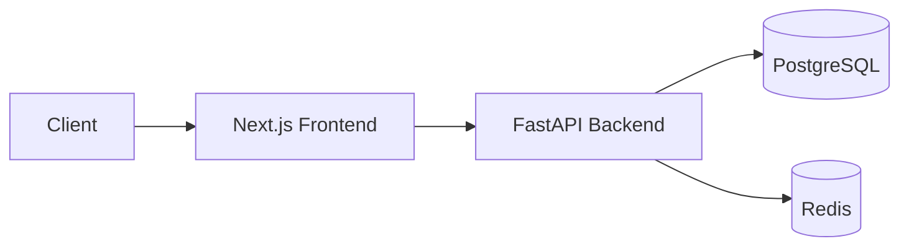

# 🎓 The Art of the README: A Masterclass

> "A project without a README is a project that doesn't exist."

This guide goes beyond the basics. It teaches you how to write documentation that **converts visitors into users** and **users into contributors**. We apply the **80/20 Rule**: 20% of the effort yields 80% of the results, but we also cover the final 20% that separates "good" from "world-class."

---

## 1. The Psychology of a README
When a developer lands on your repo, they have 3 subconscious questions:
1.  **What is this?** (Is it relevant to me?)
2.  **Does it work?** (Is it maintained/stable?)
3.  **How do I use it?** (Is it worth the effort?)

Your README must answer these in **under 5 seconds**.

---

## 2. The Anatomy of a Perfect README

### 2.1 The Hero Section (Top 200px)
This is your elevator pitch.
-   **Project Name:** Clear and bold.
-   **One-Liner:** A punchy description of *value*, not just function.
    -   *Bad:* "A Python script for scraping."
    -   *Good:* "Automated web scraper that handles captchas and proxies seamlessly."
-   **Badges:** Social proof. Use [Shields.io](https://shields.io/).
    -   Build Status (Confidence)
    -   License (Legal safety)
    -   Version (Activity)

### 2.2 The "Show, Don't Tell" (Visuals)
Humans process images 60,000x faster than text.
-   **Web App:** Use a GIF or a high-res screenshot of the dashboard.
-   **CLI Tool:** Use a terminal recording (e.g., [asciinema](https://asciinema.org/)) or a code block showing input/output.
-   **Library:** Show a minimal code example immediately.

### 2.3 The "Why" (Problem/Solution)
Don't just list features. Explain the *pain* you solve.
-   **Problem:** "Managing ML models in production is messy."
-   **Solution:** "This platform provides a unified dashboard for deployment, monitoring, and versioning."

### 2.4 The Tech Stack
Developers choose tools based on compatibility. List your stack clearly.
-   **Icons:** Use icons from [Skill Icons](https://skillicons.dev) or simple bullet points.
-   **Versions:** Mention key versions (e.g., Python 3.10+, Next.js 14).

### 2.5 Quick Start (The "Magic" Command)
Reduce friction to zero.
-   **Docker:** `docker-compose up` is the gold standard.
-   **Local:** Provide a copy-pasteable block.
    ```bash
    git clone repo
    cd repo
    npm install && npm run dev
    ```

---

## 3. Advanced Techniques (The Top 1%)

### 3.1 Architecture Diagrams
For complex systems, a diagram is essential. Use **Mermaid.js** directly in GitHub Markdown.



### 3.2 Folder Structure
Help contributors navigate your code.
```
├── app/
│   ├── api/          # Endpoints
│   └── core/         # Config
├── tests/            # Pytest
└── docker-compose.yml
```

### 3.3 Interactive Table of Contents
For long READMEs, add a clickable ToC to jump to sections.

---

## 4. Writing Style Guide
-   **Be Concise:** Cut fluff. "In order to run the server..." -> "Run the server:"
-   **Use Formatting:** **Bold** for emphasis, `code` for technical terms.
-   **Tone:** Professional but welcoming.

---

## 5. Checklist Before Publishing
-   [ ] Does the one-liner explain the *value*?
-   [ ] Is there a screenshot/GIF?
-   [ ] Do the install commands actually work? (Test in a fresh folder)
-   [ ] Are all links working?
-   [ ] Is the license clearly stated?

---

## 6. Resources & Tools
-   **Badges:** [Shields.io](https://shields.io/)
-   **Icons:** [Simple Icons](https://simpleicons.org/)
-   **Diagrams:** [Mermaid Live Editor](https://mermaid.live/)
-   **Screen Recording:** [Screen Studio](https://www.screen.studio/) (Mac) or ShareX (Windows)
