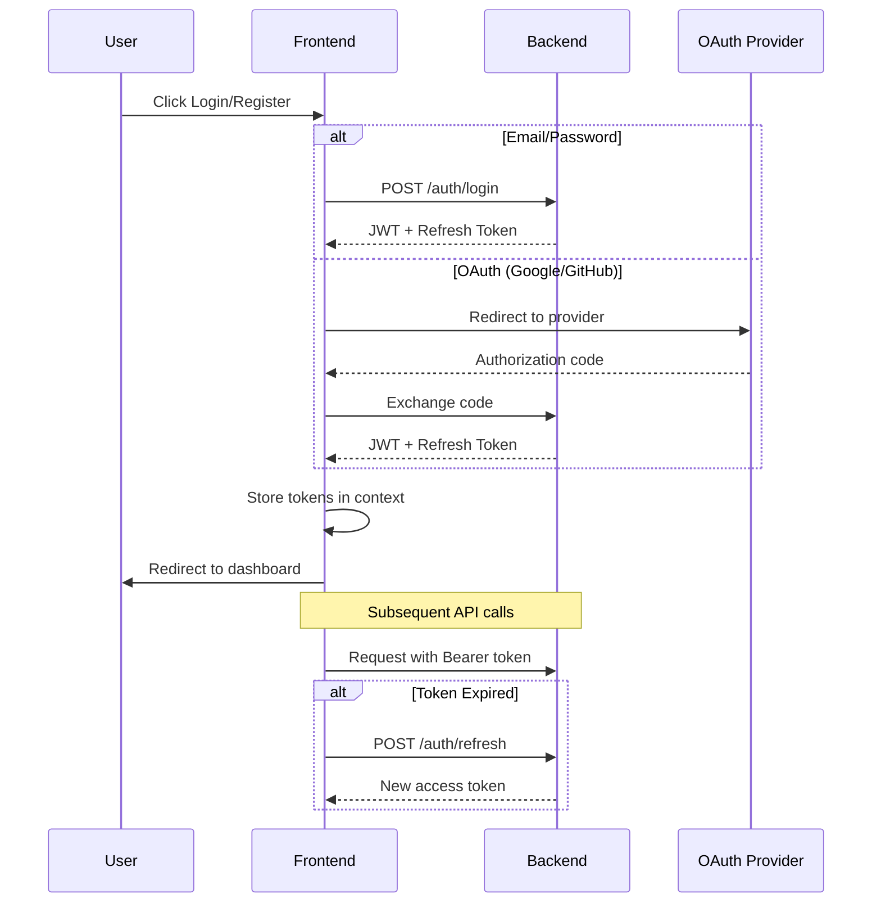

<div align="center">

# ⚛️ InferX Frontend

### **Modern, Responsive Dashboard for ML Model Management**

*A premium Next.js 16 application with React 19, featuring stunning animations, dark mode, and a production-ready component library*

<br/>


<br/>

[**🎨 Design System**](#-design-system) •
[**📦 Components**](#-component-library) •
[**🚀 Getting Started**](#-getting-started) •
[**📁 Project Structure**](#-project-structure)

</div>

---

## ✨ Highlights

<table>
<tr>
<td align="center" width="25%">
<br/>

<br/><br/>
<b>Premium UI/UX</b>
<br/>
<sub>Glassmorphism, micro-animations, and fluid transitions</sub>
</td>
<td align="center" width="25%">
<br/>

<br/><br/>
<b>Dark Mode</b>
<br/>
<sub>Beautiful light/dark themes with OKLCH color system</sub>
</td>
<td align="center" width="25%">
<br/>

<br/><br/>
<b>Fully Responsive</b>
<br/>
<sub>Mobile-first design with adaptive layouts</sub>
</td>
<td align="center" width="25%">
<br/>

<br/><br/>
<b>Blazing Fast</b>
<br/>
<sub>Server Components, streaming, and optimized bundles</sub>
</td>
</tr>
</table>

---

## 🛠️ Tech Stack

| Category | Technology | Description |
|----------|------------|-------------|
| **Framework** |  | App Router with React Server Components |
| **UI Library** |  | Latest React with concurrent features |
| **Language** |  | Full type safety across the codebase |
| **Styling** |  | Utility-first CSS with CSS variables |
| **Components** |  | Accessible, unstyled UI primitives |
| **Animations** |  | Production-ready motion library |
| **Charts** |  | Composable charting library |
| **Forms** |  | Performant forms with Zod validation |
| **Icons** |  | Beautiful & consistent icon set |
| **Theming** |  | Perfect dark mode with system preference |

---

## 🎨 Design System

### Color Palette (OKLCH)

InferX uses the modern **OKLCH color space** for perceptually uniform colors across light and dark modes.

```css
/* Primary - Royal Indigo */
--primary: oklch(0.50 0.14 265);      /* Light mode */
--primary: oklch(0.65 0.18 265);      /* Dark mode */

/* Semantic Colors */
--success: oklch(0.55 0.15 155);      /* Green */
--warning: oklch(0.70 0.15 75);       /* Amber */
--destructive: oklch(0.55 0.20 25);   /* Red */
```

### Theme Variables

| Token | Light Mode | Dark Mode | Usage |
|-------|------------|-----------|-------|
| `--background` | Near white | Deep slate | Page backgrounds |
| `--card` | Pure white | Elevated slate | Card surfaces |
| `--muted` | Soft gray | Subtle slate | Secondary content |
| `--border` | Light border | Dark border | Dividers, inputs |
| `--primary` | Indigo 500 | Indigo 400 | CTAs, active states |

### Typography

```tsx
// Fonts loaded from Google Fonts
const geist = Geist({ subsets: ["latin"] })        // UI text
const geistMono = Geist_Mono({ subsets: ["latin"] }) // Code
```

### Custom Animations

```css
/* Available animation utilities */
.animate-fade-in      /* 200ms fade */
.animate-fade-up      /* 300ms fade + slide up */
.animate-scale-in     /* 200ms scale from 96% */
```

---

## 📦 Component Library

Our **57+ UI components** are built on Radix UI primitives with custom styling:

<details>
<summary><b>🎯 Core Components (Click to expand)</b></summary>

| Component | Description |
|-----------|-------------|
| `Button` | Multiple variants: default, secondary, destructive, outline, ghost, link |
| `Card` | Container with header, content, and footer slots |
| `Dialog` | Modal dialogs with focus trap and animations |
| `Dropdown Menu` | Full-featured dropdown with submenus |
| `Form` | React Hook Form integration with Zod validation |
| `Input` | Text input with prefix/suffix support |
| `Select` | Custom select with search and multi-select |
| `Table` | Data tables with sorting, filtering, pagination |
| `Tabs` | Accessible tabbed interfaces |
| `Toast` | Notification toasts with Sonner |

</details>

<details>
<summary><b>📊 Dashboard Components</b></summary>

| Component | File | Description |
|-----------|------|-------------|
| `Sidebar` | `components/sidebar.tsx` | Collapsible nav with route highlighting |
| `DashboardHeader` | `components/dashboard-header.tsx` | Page header with actions |
| `DashboardCharts` | `components/dashboard-charts.tsx` | Analytics visualizations |
| `StatCard` | `components/stat-card.tsx` | Metric display cards |
| `ChartCard` | `components/chart-card.tsx` | Chart container |
| `DataTable` | `components/data-table.tsx` | Advanced data grid |
| `ModelsTable` | `components/models-table.tsx` | Model listing with actions |
| `PredictionsList` | `components/predictions-list.tsx` | Prediction history view |

</details>

<details>
<summary><b>🔐 Authentication Components</b></summary>

| Component | Features |
|-----------|----------|
| `Login Page` | Animated gradient background, glassmorphism, OAuth buttons |
| `Register Page` | Real-time password strength indicator, requirement checklist |
| `Auth Context` | JWT handling, token refresh, persistent sessions |

</details>

<details>
<summary><b>✨ Special Components</b></summary>

| Component | Description |
|-----------|-------------|
| `PremiumLoader` | Animated loading screen with branding |
| `LoadingSkeleton` | Shimmer skeleton states |
| `EmptyState` | Illustrated empty state with CTA |
| `ShareModelDialog` | Model sharing with permissions |
| `ApiKeyForm` | API key management UI |
| `ThemeToggle` | Animated dark mode switcher |
| `RippleButton` | Material-style ripple effect |

</details>

---

## 📁 Project Structure

```
Frontend/
├── 📁 app/                          # Next.js App Router
│   ├── 📁 (auth)/                   # Auth route group (public)
│   │   ├── login/                   # Login page with OAuth
│   │   └── register/                # Registration with validation
│   │
│   ├── 📁 (dashboard)/              # Dashboard route group (protected)
│   │   ├── dashboard/               # Main dashboard view
│   │   ├── models/                  # Model management
│   │   │   ├── page.tsx             # Models listing
│   │   │   ├── [id]/                # Model details
│   │   │   ├── upload/              # Upload new model
│   │   │   └── predict/             # Make predictions
│   │   ├── predictions/             # Prediction history
│   │   ├── webhooks/                # Webhook configuration
│   │   └── settings/                # User settings
│   │
│   ├── 📁 (landing)/                # Public landing pages
│   ├── 📁 api/                      # API routes (BFF pattern)
│   ├── 📁 auth/                     # OAuth callbacks
│   ├── globals.css                  # Global styles & theme
│   ├── layout.tsx                   # Root layout with providers
│   └── page.tsx                     # Home redirect
│
├── 📁 components/                   # React Components
│   ├── 📁 ui/                       # 57 Base UI components
│   │   ├── button.tsx
│   │   ├── card.tsx
│   │   ├── dialog.tsx
│   │   ├── form.tsx
│   │   ├── table.tsx
│   │   └── ... (50+ more)
│   │
│   ├── 📁 layout/                   # Layout components
│   │   ├── sidebar.tsx
│   │   └── navbar.tsx
│   │
│   ├── 📁 dashboard/                # Dashboard-specific
│   ├── sidebar.tsx                  # Main sidebar
│   ├── models-table.tsx             # Model data table
│   ├── predictions-list.tsx         # Predictions view
│   ├── dashboard-charts.tsx         # Analytics charts
│   ├── loading-skeleton.tsx         # Loading states
│   ├── empty-state.tsx              # Empty state UI
│   └── theme-provider.tsx           # Theme context
│
├── 📁 contexts/                     # React Contexts
│   ├── auth-context.tsx             # Authentication state
│   └── toast-context.tsx            # Toast notifications
│
├── 📁 hooks/                        # Custom Hooks
│   ├── use-auth.ts                  # Auth utilities
│   ├── use-mobile.ts                # Responsive detection
│   └── use-toast.ts                 # Toast API
│
├── 📁 lib/                          # Utilities
│   ├── api-client.ts                # Backend API client
│   └── utils.ts                     # Helper functions
│
├── 📁 public/                       # Static assets
│   └── favicon.svg
│
├── middleware.ts                    # Auth middleware
├── next.config.mjs                  # Next.js config
├── tailwind.config.ts               # Tailwind config
├── tsconfig.json                    # TypeScript config
└── package.json                     # Dependencies
```

---

## 🚀 Getting Started

### Prerequisites

- **Node.js 20+** (LTS recommended)
- **pnpm** (or npm/yarn)
- Backend API running on `http://localhost:8000`

### Installation

```bash
# Navigate to frontend directory
cd Frontend

# Install dependencies
pnpm install

# Copy environment variables
cp .env.example .env

# Start development server
pnpm dev
```

### Environment Variables

Create a `.env` file with the following:

```env
# Backend API URL
NEXT_PUBLIC_API_URL=http://localhost:8000

# OAuth Configuration (optional)
NEXT_PUBLIC_GOOGLE_CLIENT_ID=your_google_client_id
NEXT_PUBLIC_GITHUB_CLIENT_ID=your_github_client_id
```

### Available Scripts

| Command | Description |
|---------|-------------|
| `pnpm dev` | Start development server with hot reload |
| `pnpm build` | Create production build |
| `pnpm start` | Start production server |
| `pnpm lint` | Run ESLint |
| `pnpm type-check` | Run TypeScript compiler check |

---

## 🔐 Authentication Flow



---

## 📱 Responsive Breakpoints

| Breakpoint | Width | Target |
|------------|-------|--------|
| `sm` | 640px | Large phones |
| `md` | 768px | Tablets |
| `lg` | 1024px | Laptops |
| `xl` | 1280px | Desktops |
| `2xl` | 1536px | Large screens |

### Mobile Features

- **Collapsible sidebar** with slide-in animation
- **Touch-optimized** buttons and inputs
- **Mobile search** overlay
- **Bottom navigation** (planned)

---

## 🎭 Page Previews

### 📊 Dashboard
> Real-time analytics with interactive charts, model stats, and recent activity

**Features:**
- Summary stat cards with trend indicators
- Usage charts (area, bar, line)
- Recent predictions list
- Quick actions

### 📦 Models
> Complete model management interface

**Features:**
- Grid/list view toggle
- Search and filter
- Upload with drag-and-drop
- Version comparison
- Share with team

### 🔮 Predictions
> Make and track predictions

**Features:**
- JSON input editor
- Result history
- Latency metrics
- Export results

### ⚙️ Settings
> User profile and preferences

**Features:**
- Profile management
- API key generation
- Webhook configuration
- Theme preferences

---

## 🧩 Using Components

### Basic Button

```tsx
import { Button } from "@/components/ui/button"

<Button variant="default" size="lg">
  Get Started
</Button>

// Variants: default, secondary, destructive, outline, ghost, link
// Sizes: sm, default, lg, icon
```

### Card with Stats

```tsx
import { StatCard } from "@/components/stat-card"

<StatCard
  title="Total Models"
  value={42}
  change={+12.5}
  icon={<Package className="h-4 w-4" />}
/>
```

### Data Table

```tsx
import { DataTable } from "@/components/data-table"

<DataTable
  columns={columns}
  data={models}
  searchKey="name"
  pagination
/>
```

### Toast Notifications

```tsx
import { useToast } from "@/hooks/use-toast"

const { toast } = useToast()

toast({
  title: "Model uploaded",
  description: "Your model is now ready for predictions",
  variant: "success",
})
```

---

## 🌐 API Client

The `lib/api-client.ts` provides a type-safe API client:

```typescript
import { apiClient } from "@/lib/api-client"

// Authentication
await apiClient.auth.login(email, password)
await apiClient.auth.register(userData)
await apiClient.auth.logout()

// Models
await apiClient.models.list()
await apiClient.models.get(modelId)
await apiClient.models.upload(file, metadata)
await apiClient.models.delete(modelId)

// Predictions
await apiClient.predictions.create(modelId, input)
await apiClient.predictions.history(modelId)

// Analytics
await apiClient.analytics.dashboard()
await apiClient.analytics.modelStats(modelId)
```

---

## 🧪 Testing

```bash
# Run tests (when implemented)
pnpm test

# Run with coverage
pnpm test:coverage

# E2E tests with Playwright
pnpm test:e2e
```

---

## 📦 Build & Deploy

### Production Build

```bash
# Create optimized build
pnpm build

# Analyze bundle size
pnpm build:analyze
```

### Deployment Options

| Platform | Configuration |
|----------|---------------|
| **Vercel** | Zero-config, automatic |
| **Netlify** | `next export` for static |
| **Docker** | Use included `Dockerfile` |
| **Self-hosted** | `pnpm build && pnpm start` |

### Docker Build

```dockerfile
# Multi-stage build included
docker build -t inferx-frontend .
docker run -p 3000:3000 inferx-frontend
```

---

## 🎯 Performance Optimizations

| Optimization | Implementation |
|--------------|----------------|
| **Server Components** | Default for data-fetching pages |
| **Image Optimization** | Next.js Image component |
| **Code Splitting** | Automatic route-based |
| **Font Optimization** | next/font with preload |
| **CSS Optimization** | Tailwind JIT, purge unused |
| **Streaming** | Suspense boundaries |

---

## ♿ Accessibility

- ✅ **Semantic HTML** throughout
- ✅ **ARIA labels** on interactive elements
- ✅ **Keyboard navigation** fully supported
- ✅ **Focus management** for modals/dialogs
- ✅ **Color contrast** WCAG 2.1 AA compliant
- ✅ **Reduced motion** support via `prefers-reduced-motion`
- ✅ **Screen reader** friendly with Radix UI primitives

---

## 🤝 Contributing

1. Follow the established component patterns
2. Use TypeScript for all new code
3. Add stories for new components (Storybook planned)
4. Test responsive behavior
5. Ensure accessibility compliance

### Code Style

```bash
# Format code
pnpm format

# Lint code
pnpm lint

# Type check
pnpm type-check
```

---

## 📚 Resources

- [Next.js 16 Documentation](https://nextjs.org/docs)
- [React 19 Features](https://react.dev/blog)
- [Tailwind CSS v4](https://tailwindcss.com/docs)
- [Radix UI Components](https://www.radix-ui.com/primitives)
- [Framer Motion](https://www.framer.com/motion/)
- [Recharts](https://recharts.org/)

---

<div align="center">

### Part of the [InferX](../README.md) ML Platform

**Built with ❤️ using Next.js 16, React 19, and Tailwind CSS 4**

</div>
