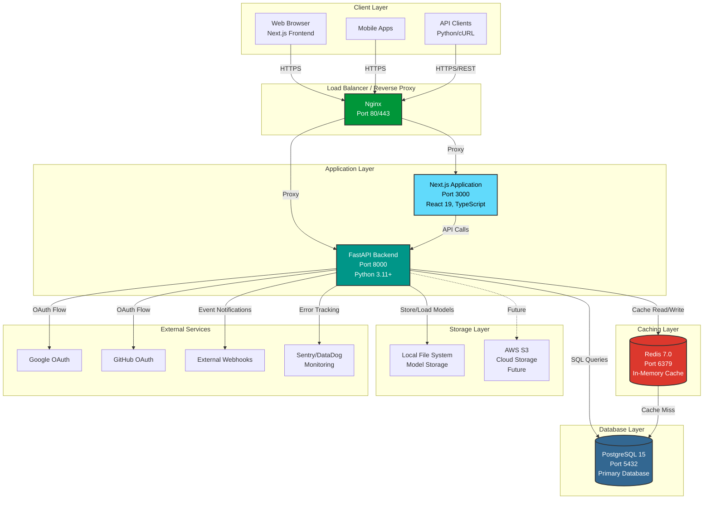

# 🚀 ML Model Serving Platform

> **A production-ready MLOps platform for deploying, monitoring, and managing Scikit-learn models with a Next.js dashboard and FastAPI backend.**


---

## 💡 What is this?

This platform bridges the gap between data science and production. It allows data scientists to upload trained models (Scikit-learn) and instantly expose them via high-performance REST APIs, while providing a modern dashboard to monitor inference performance and manage model versions.

**Why use this?**
*   **Zero-Downtime Deployment:** Deploy new model versions without restarting the server.
*   **Real-time Monitoring:** Track latency, error rates, and drift detection.
*   **Secure:** Built-in JWT authentication and API key management.

---

## 🏗️ Architecture

# System Architecture Diagram



---

## ✨ Key Features

### 🧠 Model Management
*   **Version Control:** Keep track of multiple versions of your models.
*   **Hot Reloading:** Update models in memory without downtime.
*   **Framework Agnostic:** Currently optimized for Scikit-learn, but extensible to PyTorch/TensorFlow.

### ⚡ High-Performance API
*   **FastAPI:** Built on Starlette and Pydantic for speed.
*   **Async Inference:** Non-blocking prediction endpoints.
*   **Redis Caching:** Caches frequent predictions to reduce latency.

### 📊 Interactive Dashboard
*   **Next.js 16:** Built with the latest App Router and React Server Components.
*   **Visualizations:** Real-time charts using Recharts.
*   **Modern UI:** Styled with Tailwind CSS 4 and Radix UI.

---

## 🛠️ Tech Stack

| Component | Technology | Description |
| :--- | :--- | :--- |
| **Backend** | Python 3.10+, FastAPI | High-performance API framework |
| **Frontend** | Next.js 16, React 19 | Server-side rendered dashboard |
| **Database** | PostgreSQL 15 | Relational data storage |
| **ORM** | SQLAlchemy 2.0 | Async database interaction |
| **Caching** | Redis 7 | In-memory data structure store |
| **Container** | Docker & Compose | Orchestration and deployment |
| **Monitoring** | Sentry | Error tracking and performance monitoring |

---

## 🚀 Quick Start

### Prerequisites
*   Docker & Docker Compose installed.

### Option A: Run with Docker (Recommended)
The easiest way to spin up the entire stack (Frontend, Backend, DB, Redis).

```bash
# 1. Clone the repository
git clone https://github.com/yourusername/ml-model-serving.git
cd ml-model-serving

# 2. Set up environment variables
cp .env.example .env

# 3. Start the services
docker-compose up --build
```

Access the apps:
*   **Frontend Dashboard:** `http://localhost:3000`
*   **API Documentation:** `http://localhost:8000/docs`

### Option B: Local Development

<details>
<summary><strong>Click to expand instructions</strong></summary>

#### Backend
```bash
cd ML-Model-Serving-Platform
python -m venv venv
source venv/bin/activate  # Windows: venv\Scripts\activate
pip install -r requirements.txt
uvicorn app.main:app --reload
```

#### Frontend
```bash
cd Frontend
npm install
npm run dev
```
</details>

---

## 📂 Project Structure

```bash
├── Frontend/                 # Next.js Web Application
│   ├── app/                  # App Router pages ((dashboard), (auth))
│   ├── components/           # Reusable UI components
│   └── lib/                  # Utilities and API clients
│
├── ML-Model-Serving-Platform/ # FastAPI Backend
│   ├── app/
│   │   ├── api/              # API Routes (auth, models, predictions)
│   │   ├── core/             # Config & Security
│   │   ├── models/           # Database Models
│   │   └── services/         # Business Logic
│   ├── alembic/              # Database Migrations
│   └── tests/                # Pytest suites
```

---

## 🤝 Contributing

Contributions are welcome! Please read our [Contributing Guide](CONTRIBUTING.md) for details on our code of conduct and the process for submitting pull requests.

1.  Fork the Project
2.  Create your Feature Branch (`git checkout -b feature/AmazingFeature`)
3.  Commit your Changes (`git commit -m 'Add some AmazingFeature'`)
4.  Push to the Branch (`git push origin feature/AmazingFeature`)
5.  Open a Pull Request

---

## 📄 License

Distributed under the MIT License. See `LICENSE` for more information.
