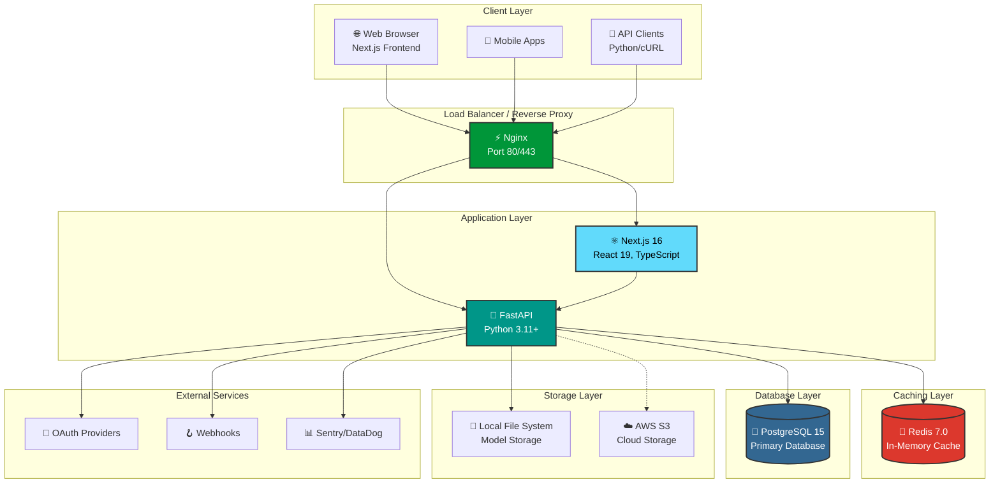
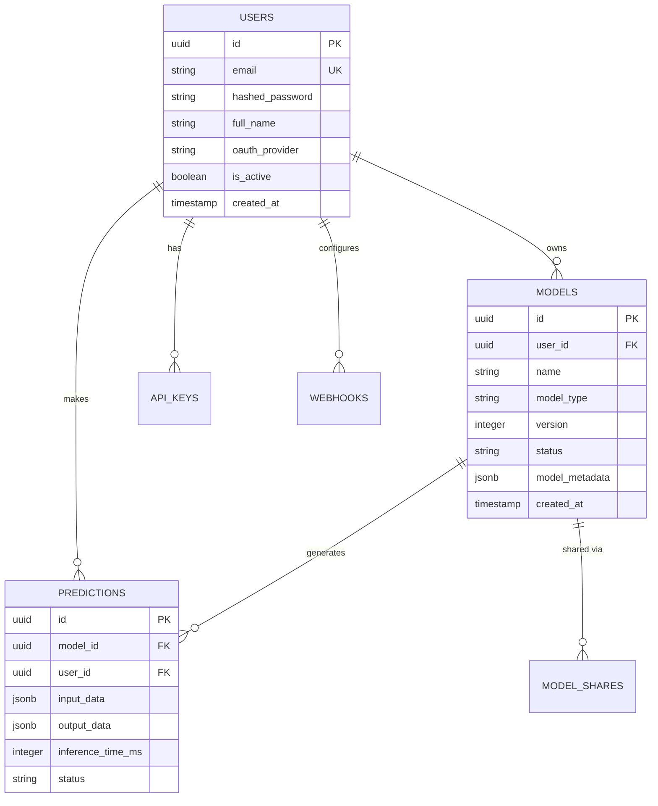
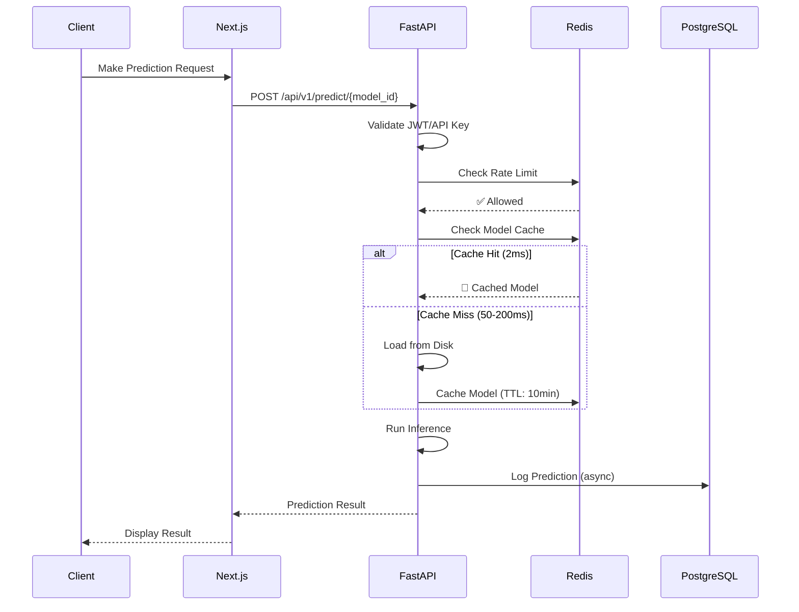

<div align="center">

# 🚀 InferX

### **The Modern MLOps Platform for Production-Ready ML Inference**

*Deploy, Monitor, and Scale your Machine Learning models with zero DevOps knowledge*

[](https://inferx.vercel.app)
[](https://api.inferx.dev/docs)

<br/>

https://github.com/user-attachments/assets/YOUR_DEMO_VIDEO_ID

<br/>


<br/>

[**📖 Documentation**](#-documentation) •
[**✨ Features**](#-features) •
[**🏗️ Architecture**](#️-architecture) •
[**🚀 Getting Started**](#-getting-started) •
[**📊 Demo**](#-demo)

</div>

---

## 💡 The Problem & Solution

<table>
<tr>
<td width="50%">

### ❌ Traditional ML Deployment

- Writing custom Flask/FastAPI endpoints for each model
- Managing model versioning manually
- No standardized way to monitor model performance
- Complex DevOps setup for every deployment
- Hours spent on infrastructure instead of ML

</td>
<td width="50%">

### ✅ With InferX

- **Upload once**, get REST API instantly
- Automatic versioning with rollback support
- Real-time analytics dashboard
- Docker-ready, cloud-native architecture
- Deploy in minutes, not days

</td>
</tr>
</table>

> **Think of InferX as "Vercel for ML Models"** — Upload your trained model, and we handle the rest.

---

## ✨ Features

<table>
<tr>
<td align="center" width="25%">

<br/><b>🧠 Smart Model Management</b>
<br/><sub>Upload, version, and organize your ML models with automatic versioning and hot-reload capabilities</sub>
</td>
<td align="center" width="25%">

<br/><b>⚡ Lightning Fast Inference</b>
<br/><sub>2ms cached predictions with Redis LRU caching and async processing</sub>
</td>
<td align="center" width="25%">

<br/><b>📊 Real-time Analytics</b>
<br/><sub>Monitor latency, success rates, usage trends, and model health in real-time</sub>
</td>
<td align="center" width="25%">

<br/><b>🔐 Enterprise Security</b>
<br/><sub>JWT + API Keys, OAuth (Google/GitHub), rate limiting, RBAC permissions</sub>
</td>
</tr>
</table>

### Feature Highlights

| Category | Features |
|----------|----------|
| **🔐 Authentication** | JWT with refresh tokens • OAuth (Google, GitHub) • API Key management • Argon2 password hashing |
| **📦 Model Management** | Upload (.pkl, .joblib) • Auto versioning • Status management (active/deprecated/archived) • Model sharing with permissions |
| **🚀 Predictions** | Sub-2ms cached inference • Async processing • Batch predictions • Confidence scores |
| **📊 Analytics** | Real-time dashboards • Usage trends • Error tracking • Inference time monitoring |
| **🪝 Webhooks** | Custom event notifications • HMAC signatures • Retry logic • Model-specific triggers |
| **⚡ Performance** | Redis LRU caching • Token bucket rate limiting • Connection pooling • Background jobs |
| **🛡️ Security** | CORS configuration • Input validation (Pydantic) • SQL injection prevention • HTTPS ready |
| **🐳 DevOps** | Docker Compose • Multi-stage builds • Health checks • CI/CD ready |

---

## 🏗️ Architecture

InferX follows a **modern microservices-friendly monolith** architecture, designed for scalability and maintainability.



### 📊 Database Schema



### 🔄 Request Flow



---

## 🛠️ Tech Stack

<table>
<tr>
<td>

### Backend
| Technology | Purpose |
|------------|---------|
|  | High-performance async API |
|  | Core language |
|  | Primary database |
|  | Caching & rate limiting |
|  | Async ORM |
|  | Data validation |

</td>
<td>

### Frontend
| Technology | Purpose |
|------------|---------|
|  | React framework |
|  | UI library |
|  | Type safety |
|  | Styling |
|  | UI primitives |
|  | Animations |

</td>
</tr>
</table>

### ML & DevOps

| Category | Stack |
|----------|-------|
| **ML Framework** | Scikit-learn 1.3, NumPy, Joblib (TensorFlow/PyTorch planned) |
| **Containerization** | Docker, Docker Compose, Multi-stage builds |
| **Testing** | Pytest (77% coverage), pytest-cov, pytest-asyncio |
| **CI/CD** | GitHub Actions, automated testing on push |
| **Monitoring** | Sentry, structured JSON logging |

---

## 🚀 Getting Started

### Prerequisites

- **Docker & Docker Compose** (recommended)
- Or: Python 3.11+, Node.js 22+, PostgreSQL 15+, Redis 7+

### 🐳 Quick Start with Docker (Recommended)

```bash
# 1. Clone the repository
git clone https://github.com/wittyparth/InferX.git
cd InferX

# 2. Set up environment variables
cp .env.example .env

# 3. Start all services
docker-compose up -d

# 4. Run database migrations
docker-compose exec backend alembic upgrade head
```

**Access the apps:**
| Service | URL |
|---------|-----|
| 🌐 **Frontend Dashboard** | http://localhost:3000 |
| 📚 **API Documentation** | http://localhost:8000/docs |
| 🔍 **ReDoc API Docs** | http://localhost:8000/redoc |

### 💻 Local Development Setup

<details>
<summary><b>Backend Setup</b></summary>

```bash
cd Backend

# Create virtual environment
python -m venv venv
source venv/bin/activate  # Windows: venv\Scripts\activate

# Install dependencies
pip install -r requirements.txt

# Set up environment
cp .env.example .env.development

# Run migrations
alembic upgrade head

# Start development server
uvicorn app.main:app --reload --port 8000
```
</details>

<details>
<summary><b>Frontend Setup</b></summary>

```bash
cd Frontend

# Install dependencies
npm install  # or pnpm install

# Set up environment
cp .env.example .env

# Start development server
npm run dev
```
</details>

---

## 📖 API Reference

### Quick Examples

<details>
<summary><b>🔐 Authentication</b></summary>

**Register a new user:**
```bash
curl -X POST http://localhost:8000/api/v1/auth/register \
  -H "Content-Type: application/json" \
  -d '{
    "email": "user@example.com",
    "password": "SecureP@ss123",
    "full_name": "John Doe"
  }'
```

**Login:**
```bash
curl -X POST http://localhost:8000/api/v1/auth/login \
  -H "Content-Type: application/json" \
  -d '{
    "email": "user@example.com",
    "password": "SecureP@ss123"
  }'
```
</details>

<details>
<summary><b>📦 Model Upload</b></summary>

```bash
curl -X POST http://localhost:8000/api/v1/models/upload \
  -H "Authorization: Bearer YOUR_ACCESS_TOKEN" \
  -F "file=@iris_classifier.pkl" \
  -F "name=iris_classifier" \
  -F "model_type=sklearn" \
  -F "description=Iris flower classification model"
```
</details>

<details>
<summary><b>🔮 Make Predictions</b></summary>

```bash
curl -X POST http://localhost:8000/api/v1/predict/{model_id} \
  -H "Authorization: Bearer YOUR_ACCESS_TOKEN" \
  -H "Content-Type: application/json" \
  -d '{
    "input": {
      "sepal_length": 5.1,
      "sepal_width": 3.5,
      "petal_length": 1.4,
      "petal_width": 0.2
    }
  }'
```

**Response:**
```json
{
  "prediction": [0],
  "probabilities": [[0.97, 0.02, 0.01]],
  "confidence": 0.97,
  "inference_time_ms": 2,
  "cache_hit": true
}
```
</details>

---

## 📊 Performance

| Metric | Value |
|--------|-------|
| 🚀 **Cached Prediction Latency** | ~2ms |
| 📦 **Cold Model Load** | ~50-200ms |
| 🔄 **Cache Hit Rate** | >70% |
| 📈 **Concurrent Users Tested** | 100+ |
| ✅ **Test Coverage** | 77% |
| 🔧 **API Endpoints** | 30+ |

---

## 📂 Project Structure

```
InferX/
├── 🐍 Backend/                      # FastAPI Application
│   ├── app/
│   │   ├── api/                     # API Routes (auth, models, predictions)
│   │   ├── core/                    # Config, Security, Dependencies
│   │   ├── models/                  # SQLAlchemy Database Models
│   │   ├── schemas/                 # Pydantic Schemas
│   │   ├── services/                # Business Logic Layer
│   │   └── main.py                  # Application Entry Point
│   ├── alembic/                     # Database Migrations
│   ├── tests/                       # Pytest Test Suites
│   └── requirements.txt
│
├── ⚛️ Frontend/                     # Next.js 16 Application
│   ├── app/
│   │   ├── (auth)/                  # Authentication Pages
│   │   ├── (dashboard)/             # Protected Dashboard Routes
│   │   └── (landing)/               # Public Landing Pages
│   ├── components/                  # Reusable UI Components
│   ├── contexts/                    # React Context Providers
│   ├── hooks/                       # Custom React Hooks
│   └── lib/                         # Utilities & API Clients
│
├── 🐳 docker-compose.yml            # Development Environment
├── 🐳 docker-compose.prod.yml       # Production Environment
├── 📚 Docs/                         # Learning Guides & Documentation
└── 📊 mermaid/                      # Architecture Diagrams
```

---

## 🧪 Testing

```bash
# Run all tests
cd Backend && pytest

# Run with coverage report
pytest --cov=app --cov-report=html

# Run specific test file
pytest tests/test_auth.py -v

# Run integration tests only
pytest tests/integration/ -v
```

**Current Test Coverage:** 77% (39 passing tests)

---

## 🗺️ Roadmap

- [x] **Core MVP** — Authentication, Model Upload, Predictions
- [x] **Analytics Dashboard** — Real-time monitoring
- [x] **API Keys** — Programmatic access
- [x] **Model Sharing** — Granular permissions
- [x] **Webhooks** — Event notifications
- [x] **Rate Limiting** — Token bucket algorithm
- [ ] **TensorFlow/PyTorch Support** — Coming soon
- [ ] **Model A/B Testing** — Planned
- [ ] **Data Drift Detection** — Planned
- [ ] **Python SDK** — In development

---

## 🎓 What I Learned

This project demonstrates proficiency in:

| Area | Skills |
|------|--------|
| **Backend Development** | FastAPI, REST APIs, async Python, dependency injection |
| **Frontend Development** | Next.js 16 App Router, React 19, TypeScript, Tailwind CSS |
| **Database Design** | PostgreSQL, SQLAlchemy 2.0, Alembic migrations, indexing strategies |
| **Caching Strategies** | Redis, cache-aside pattern, LRU caching, TTL management |
| **Authentication** | JWT, OAuth 2.0, password hashing (Argon2), API key management |
| **System Design** | Microservices patterns, rate limiting, webhooks, background jobs |
| **DevOps** | Docker, Docker Compose, multi-stage builds, CI/CD |
| **Testing** | Unit tests, integration tests, pytest fixtures, 77% coverage |

---

## 👨‍💻 Author

<div align="center">

**Partha Saradhi Munakala**

IIT (ISM) Dhanbad — Electrical Engineering

[](https://github.com/wittyparth)
[](https://linkedin.com/in/wittyparth)
[](https://leetcode.com/wittyparth)

</div>

---

## 📄 License

This project is licensed under the **MIT License** — see the [LICENSE](LICENSE) file for details.

---

<div align="center">

### ⭐ Star this repo if you found it helpful!

**Built with ❤️ to master full-stack development and MLOps**

<br/>


</div>
