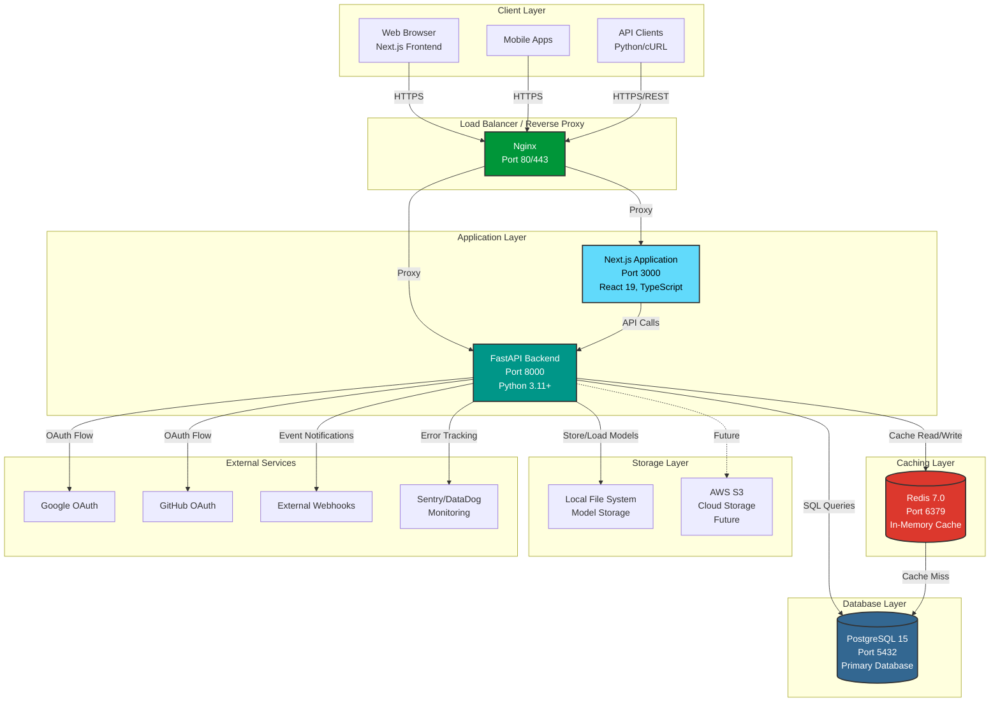

# System Architecture Diagram

```mermaid
graph TB
    subgraph "Client Layer"
        WEB[Web Browser<br/>Next.js Frontend]
        MOBILE[Mobile Apps]
        API_CLIENT[API Clients<br/>Python/cURL]
    end

    subgraph "Load Balancer / Reverse Proxy"
        NGINX[Nginx<br/>Port 80/443]
    end

    subgraph "Application Layer"
        FRONTEND[Next.js Application<br/>Port 3000<br/>React 19, TypeScript]
        BACKEND[FastAPI Backend<br/>Port 8000<br/>Python 3.11+]
    end

    subgraph "Caching Layer"
        REDIS[(Redis 7.0<br/>Port 6379<br/>In-Memory Cache)]
    end

    subgraph "Database Layer"
        POSTGRES[(PostgreSQL 15<br/>Port 5432<br/>Primary Database)]
    end

    subgraph "Storage Layer"
        LOCAL_STORAGE[Local File System<br/>Model Storage]
        S3[AWS S3<br/>Cloud Storage<br/>Future]
    end

    subgraph "External Services"
        OAUTH_GOOGLE[Google OAuth]
        OAUTH_GITHUB[GitHub OAuth]
        WEBHOOKS[External Webhooks]
        MONITORING[Sentry/DataDog<br/>Monitoring]
    end

    WEB -->|HTTPS| NGINX
    MOBILE -->|HTTPS| NGINX
    API_CLIENT -->|HTTPS/REST| NGINX
    
    NGINX -->|Proxy| FRONTEND
    NGINX -->|Proxy| BACKEND
    
    FRONTEND -->|API Calls| BACKEND
    
    BACKEND -->|Cache Read/Write| REDIS
    BACKEND -->|SQL Queries| POSTGRES
    BACKEND -->|Store/Load Models| LOCAL_STORAGE
    BACKEND -.->|Future| S3
    BACKEND -->|OAuth Flow| OAUTH_GOOGLE
    BACKEND -->|OAuth Flow| OAUTH_GITHUB
    BACKEND -->|Event Notifications| WEBHOOKS
    BACKEND -->|Error Tracking| MONITORING
    
    REDIS -->|Cache Miss| POSTGRES
    
    style FRONTEND fill:#61dafb,stroke:#333,stroke-width:2px,color:#000
    style BACKEND fill:#009688,stroke:#333,stroke-width:2px,color:#fff
    style POSTGRES fill:#336791,stroke:#333,stroke-width:2px,color:#fff
    style REDIS fill:#dc382d,stroke:#333,stroke-width:2px,color:#fff
    style NGINX fill:#009639,stroke:#333,stroke-width:2px,color:#fff
```
