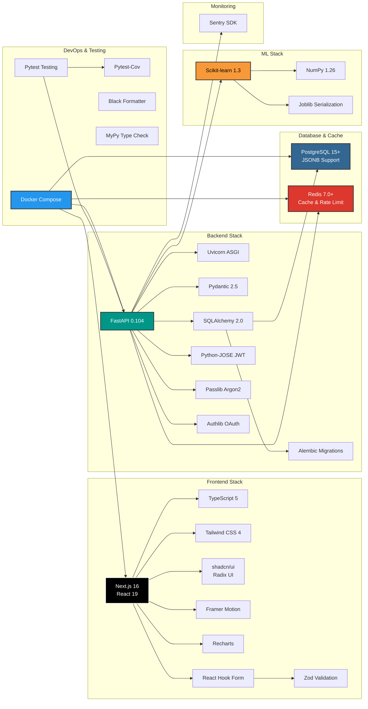

# Technology Stack Diagram

```mermaid
graph LR
    subgraph "Frontend Stack"
        NEXTJS[Next.js 16<br/>React 19]
        TS[TypeScript 5]
        TAILWIND[Tailwind CSS 4]
        SHADCN[shadcn/ui<br/>Radix UI]
        FRAMER[Framer Motion]
        RECHARTS[Recharts]
        RHF[React Hook Form]
        ZOD[Zod Validation]
    end

    subgraph "Backend Stack"
        FASTAPI[FastAPI 0.104]
        UVICORN[Uvicorn ASGI]
        PYDANTIC[Pydantic 2.5]
        SQLALCHEMY[SQLAlchemy 2.0]
        ALEMBIC[Alembic Migrations]
        JOSE[Python-JOSE JWT]
        PASSLIB[Passlib Argon2]
        AUTHLIB[Authlib OAuth]
    end

    subgraph "ML Stack"
        SKLEARN[Scikit-learn 1.3]
        NUMPY[NumPy 1.26]
        JOBLIB[Joblib Serialization]
    end

    subgraph "Database & Cache"
        PG[PostgreSQL 15+<br/>JSONB Support]
        REDIS_TECH[Redis 7.0+<br/>Cache & Rate Limit]
    end

    subgraph "DevOps & Testing"
        DOCKER[Docker Compose]
        PYTEST[Pytest Testing]
        COV[Pytest-Cov]
        BLACK[Black Formatter]
        MYPY[MyPy Type Check]
    end

    subgraph "Monitoring"
        SENTRY[Sentry SDK]
    end

    NEXTJS --> TS
    NEXTJS --> TAILWIND
    NEXTJS --> SHADCN
    NEXTJS --> FRAMER
    NEXTJS --> RECHARTS
    NEXTJS --> RHF
    RHF --> ZOD

    FASTAPI --> UVICORN
    FASTAPI --> PYDANTIC
    FASTAPI --> SQLALCHEMY
    SQLALCHEMY --> ALEMBIC
    FASTAPI --> JOSE
    FASTAPI --> PASSLIB
    FASTAPI --> AUTHLIB

    FASTAPI --> SKLEARN
    SKLEARN --> NUMPY
    SKLEARN --> JOBLIB

    SQLALCHEMY --> PG
    FASTAPI --> REDIS_TECH

    DOCKER --> FASTAPI
    DOCKER --> NEXTJS
    DOCKER --> PG
    DOCKER --> REDIS_TECH

    PYTEST --> FASTAPI
    PYTEST --> COV
    
    FASTAPI --> SENTRY

    style NEXTJS fill:#000,stroke:#fff,stroke-width:2px,color:#fff
    style FASTAPI fill:#009688,stroke:#333,stroke-width:2px,color:#fff
    style SKLEARN fill:#f89939,stroke:#333,stroke-width:2px,color:#000
    style PG fill:#336791,stroke:#333,stroke-width:2px,color:#fff
    style REDIS_TECH fill:#dc382d,stroke:#333,stroke-width:2px,color:#fff
    style DOCKER fill:#2496ed,stroke:#333,stroke-width:2px,color:#fff
```
