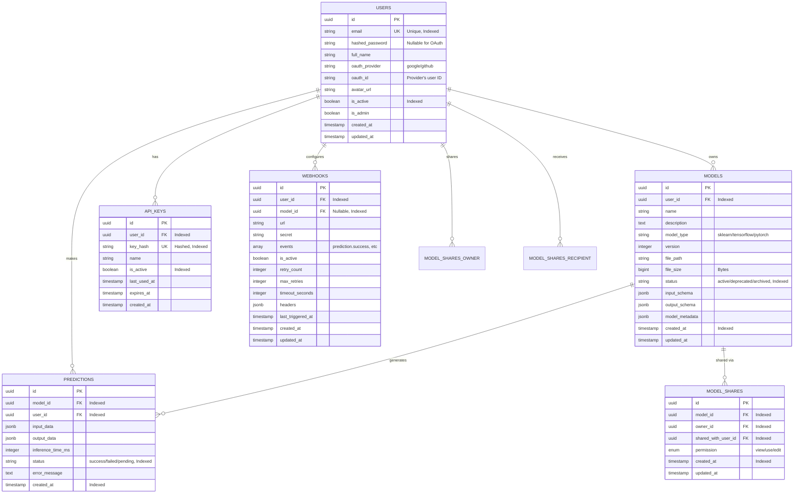

# Database ER Diagram

```mermaid
erDiagram
    USERS ||--o{ MODELS : owns
    USERS ||--o{ PREDICTIONS : makes
    USERS ||--o{ API_KEYS : has
    USERS ||--o{ WEBHOOKS : configures
    USERS ||--o{ MODEL_SHARES_OWNER : shares
    USERS ||--o{ MODEL_SHARES_RECIPIENT : receives
    
    MODELS ||--o{ PREDICTIONS : generates
    MODELS ||--o{ MODEL_SHARES : "shared via"
    
    USERS {
        uuid id PK
        string email UK "Unique, Indexed"
        string hashed_password "Nullable for OAuth"
        string full_name
        string oauth_provider "google/github"
        string oauth_id "Provider's user ID"
        string avatar_url
        boolean is_active "Indexed"
        boolean is_admin
        timestamp created_at
        timestamp updated_at
    }

    MODELS {
        uuid id PK
        uuid user_id FK "Indexed"
        string name
        text description
        string model_type "sklearn/tensorflow/pytorch"
        integer version
        string file_path
        bigint file_size "Bytes"
        string status "active/deprecated/archived, Indexed"
        jsonb input_schema
        jsonb output_schema
        jsonb model_metadata
        timestamp created_at "Indexed"
        timestamp updated_at
    }

    PREDICTIONS {
        uuid id PK
        uuid model_id FK "Indexed"
        uuid user_id FK "Indexed"
        jsonb input_data
        jsonb output_data
        integer inference_time_ms
        string status "success/failed/pending, Indexed"
        text error_message
        timestamp created_at "Indexed"
    }

    API_KEYS {
        uuid id PK
        uuid user_id FK "Indexed"
        string key_hash UK "Hashed, Indexed"
        string name
        boolean is_active "Indexed"
        timestamp last_used_at
        timestamp expires_at
        timestamp created_at
    }

    WEBHOOKS {
        uuid id PK
        uuid user_id FK "Indexed"
        uuid model_id FK "Nullable, Indexed"
        string url
        string secret
        array events "prediction.success, etc"
        boolean is_active
        integer retry_count
        integer max_retries
        integer timeout_seconds
        jsonb headers
        timestamp last_triggered_at
        timestamp created_at
        timestamp updated_at
    }

    MODEL_SHARES {
        uuid id PK
        uuid model_id FK "Indexed"
        uuid owner_id FK "Indexed"
        uuid shared_with_user_id FK "Indexed"
        enum permission "view/use/edit"
        timestamp created_at "Indexed"
        timestamp updated_at
    }
```
