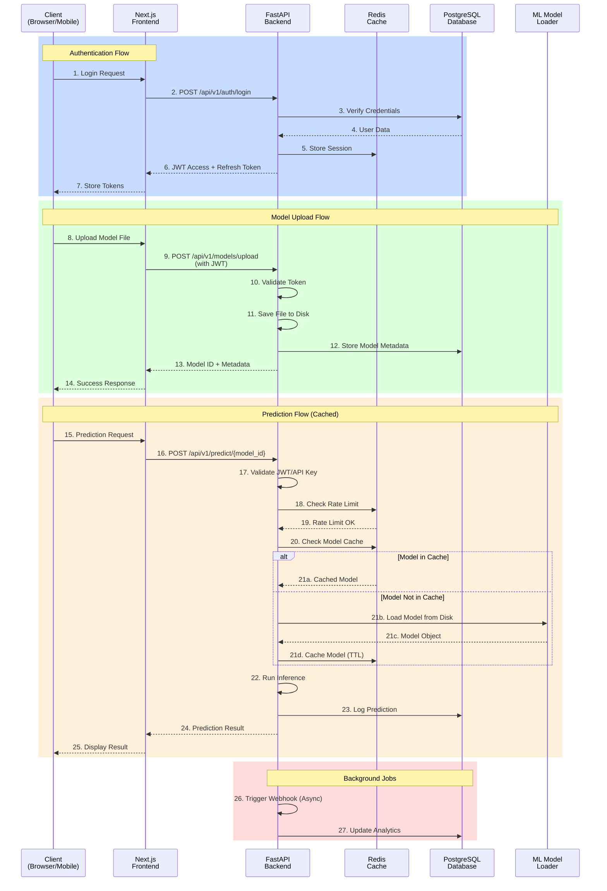

# API Request Flow Diagram

```mermaid
sequenceDiagram
    participant Client as Client<br/>(Browser/Mobile)
    participant Frontend as Next.js<br/>Frontend
    participant Backend as FastAPI<br/>Backend
    participant Redis as Redis<br/>Cache
    participant DB as PostgreSQL<br/>Database
    participant ML as ML Model<br/>Loader

    rect rgb(200, 220, 255)
        Note over Client,Frontend: Authentication Flow
        Client->>Frontend: 1. Login Request
        Frontend->>Backend: 2. POST /api/v1/auth/login
        Backend->>DB: 3. Verify Credentials
        DB-->>Backend: 4. User Data
        Backend->>Redis: 5. Store Session
        Backend-->>Frontend: 6. JWT Access + Refresh Token
        Frontend-->>Client: 7. Store Tokens
    end

    rect rgb(220, 255, 220)
        Note over Client,ML: Model Upload Flow
        Client->>Frontend: 8. Upload Model File
        Frontend->>Backend: 9. POST /api/v1/models/upload<br/>(with JWT)
        Backend->>Backend: 10. Validate Token
        Backend->>Backend: 11. Save File to Disk
        Backend->>DB: 12. Store Model Metadata
        Backend-->>Frontend: 13. Model ID + Metadata
        Frontend-->>Client: 14. Success Response
    end

    rect rgb(255, 240, 220)
        Note over Client,ML: Prediction Flow (Cached)
        Client->>Frontend: 15. Prediction Request
        Frontend->>Backend: 16. POST /api/v1/predict/{model_id}
        Backend->>Backend: 17. Validate JWT/API Key
        Backend->>Redis: 18. Check Rate Limit
        Redis-->>Backend: 19. Rate Limit OK
        Backend->>Redis: 20. Check Model Cache
        
        alt Model in Cache
            Redis-->>Backend: 21a. Cached Model
        else Model Not in Cache
            Backend->>ML: 21b. Load Model from Disk
            ML-->>Backend: 21c. Model Object
            Backend->>Redis: 21d. Cache Model (TTL)
        end
        
        Backend->>Backend: 22. Run Inference
        Backend->>DB: 23. Log Prediction
        Backend-->>Frontend: 24. Prediction Result
        Frontend-->>Client: 25. Display Result
    end

    rect rgb(255, 220, 220)
        Note over Backend,DB: Background Jobs
        Backend->>Backend: 26. Trigger Webhook (Async)
        Backend->>DB: 27. Update Analytics
    end
```
