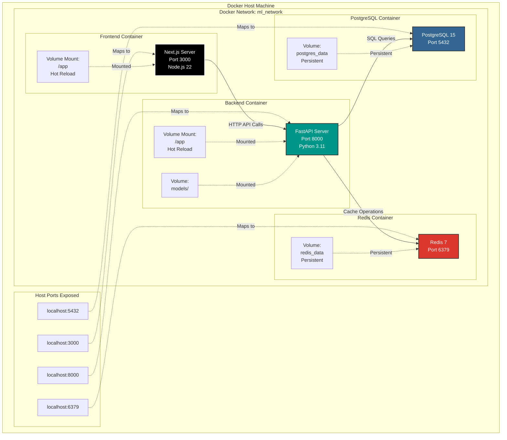

# Docker Container Architecture

```mermaid
graph TB
    subgraph "Docker Host Machine"
        subgraph "Docker Network: ml_network"
            subgraph "Frontend Container"
                NEXT[Next.js Server<br/>Port 3000<br/>Node.js 22]
                NEXT_VOL[Volume Mount:<br/>/app<br/>Hot Reload]
            end

            subgraph "Backend Container"
                FAST[FastAPI Server<br/>Port 8000<br/>Python 3.11]
                FAST_VOL[Volume Mount:<br/>/app<br/>Hot Reload]
                MODELS_DIR[Volume:<br/>models/]
            end

            subgraph "PostgreSQL Container"
                PG_SERVER[PostgreSQL 15<br/>Port 5432]
                PG_VOL[Volume:<br/>postgres_data<br/>Persistent]
            end

            subgraph "Redis Container"
                REDIS_SERVER[Redis 7<br/>Port 6379]
                REDIS_VOL[Volume:<br/>redis_data<br/>Persistent]
            end
        end

        subgraph "Host Ports Exposed"
            HOST_3000[localhost:3000]
            HOST_8000[localhost:8000]
            HOST_5432[localhost:5432]
            HOST_6379[localhost:6379]
        end
    end

    HOST_3000 -.->|Maps to| NEXT
    HOST_8000 -.->|Maps to| FAST
    HOST_5432 -.->|Maps to| PG_SERVER
    HOST_6379 -.->|Maps to| REDIS_SERVER

    NEXT -->|HTTP API Calls| FAST
    FAST -->|SQL Queries| PG_SERVER
    FAST -->|Cache Operations| REDIS_SERVER

    NEXT_VOL -.->|Mounted| NEXT
    FAST_VOL -.->|Mounted| FAST
    MODELS_DIR -.->|Mounted| FAST
    PG_VOL -.->|Persistent| PG_SERVER
    REDIS_VOL -.->|Persistent| REDIS_SERVER

    style NEXT fill:#000,stroke:#fff,stroke-width:2px,color:#fff
    style FAST fill:#009688,stroke:#333,stroke-width:2px,color:#fff
    style PG_SERVER fill:#336791,stroke:#333,stroke-width:2px,color:#fff
    style REDIS_SERVER fill:#dc382d,stroke:#333,stroke-width:2px,color:#fff
```
