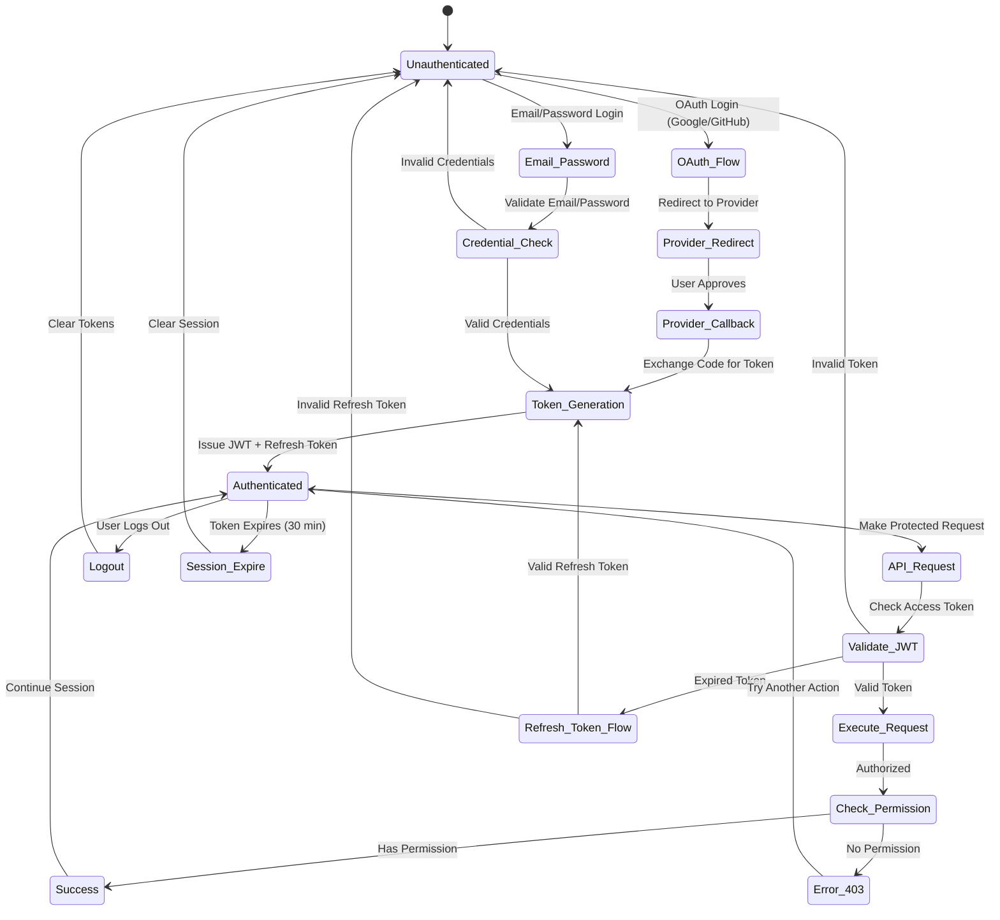

# Authentication & Authorization Flow

```mermaid
stateDiagram-v2
    [*] --> Unauthenticated
    
    Unauthenticated --> OAuth_Flow : OAuth Login (Google/GitHub)
    Unauthenticated --> Email_Password : Email/Password Login
    
    OAuth_Flow --> Provider_Redirect : Redirect to Provider
    Provider_Redirect --> Provider_Callback : User Approves
    Provider_Callback --> Token_Generation : Exchange Code for Token
    
    Email_Password --> Credential_Check : Validate Email/Password
    Credential_Check --> Token_Generation : Valid Credentials
    Credential_Check --> Unauthenticated : Invalid Credentials
    
    Token_Generation --> Authenticated : Issue JWT + Refresh Token
    
    Authenticated --> API_Request : Make Protected Request
    
    API_Request --> Validate_JWT : Check Access Token
    Validate_JWT --> Execute_Request : Valid Token
    Validate_JWT --> Refresh_Token_Flow : Expired Token
    Validate_JWT --> Unauthenticated : Invalid Token
    
    Refresh_Token_Flow --> Token_Generation : Valid Refresh Token
    Refresh_Token_Flow --> Unauthenticated : Invalid Refresh Token
    
    Execute_Request --> Check_Permission : Authorized
    Check_Permission --> Success : Has Permission
    Check_Permission --> Error_403 : No Permission
    
    Success --> Authenticated : Continue Session
    Error_403 --> Authenticated : Try Another Action
    
    Authenticated --> Logout : User Logs Out
    Logout --> Unauthenticated : Clear Tokens
    
    Authenticated --> Session_Expire : Token Expires (30 min)
    Session_Expire --> Unauthenticated : Clear Session
```
