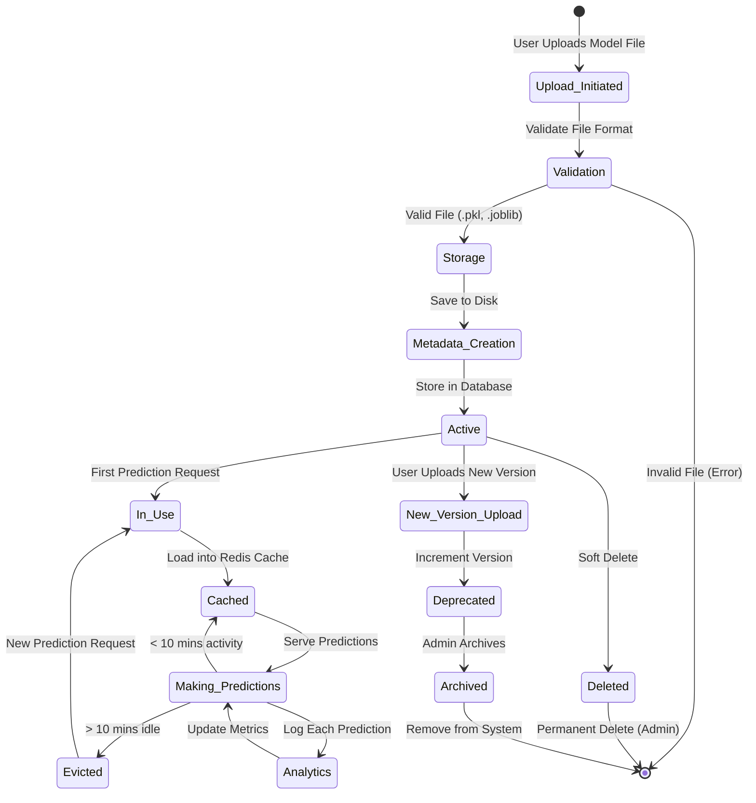

# ML Model Lifecycle

```mermaid
stateDiagram-v2
    [*] --> Upload_Initiated : User Uploads Model File
    
    Upload_Initiated --> Validation : Validate File Format
    Validation --> Storage : Valid File (.pkl, .joblib)
    Validation --> [*] : Invalid File (Error)
    
    Storage --> Metadata_Creation : Save to Disk
    Metadata_Creation --> Active : Store in Database
    
    Active --> In_Use : First Prediction Request
    In_Use --> Cached : Load into Redis Cache
    
    Cached --> Making_Predictions : Serve Predictions
    Making_Predictions --> Cached : < 10 mins activity
    Making_Predictions --> Evicted : > 10 mins idle
    
    Evicted --> In_Use : New Prediction Request
    
    Active --> New_Version_Upload : User Uploads New Version
    New_Version_Upload --> Deprecated : Increment Version
    Deprecated --> Archived : Admin Archives
    
    Active --> Deleted : Soft Delete
    Deleted --> [*] : Permanent Delete (Admin)
    
    Archived --> [*] : Remove from System
    
    Making_Predictions --> Analytics : Log Each Prediction
    Analytics --> Making_Predictions : Update Metrics
```
