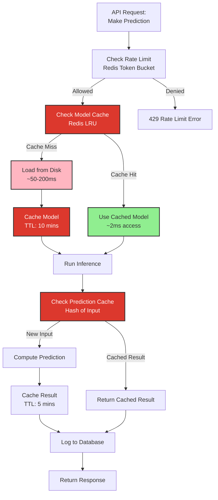

# Caching Strategy Diagram

```mermaid
graph TB
    REQUEST[API Request:<br/>Make Prediction]
    
    REQUEST --> CHECK_RATE[Check Rate Limit<br/>Redis Token Bucket]
    
    CHECK_RATE -->|Allowed| CHECK_MODEL[Check Model Cache<br/>Redis LRU]
    CHECK_RATE -->|Denied| RATE_ERROR[429 Rate Limit Error]
    
    CHECK_MODEL -->|Cache Hit| CACHED_MODEL[Use Cached Model<br/>~2ms access]
    CHECK_MODEL -->|Cache Miss| LOAD_MODEL[Load from Disk<br/>~50-200ms]
    
    LOAD_MODEL --> CACHE_MODEL[Cache Model<br/>TTL: 10 mins]
    CACHE_MODEL --> INFERENCE
    CACHED_MODEL --> INFERENCE[Run Inference]
    
    INFERENCE --> CHECK_PRED_CACHE[Check Prediction Cache<br/>Hash of Input]
    CHECK_PRED_CACHE -->|Cached Result| RETURN_CACHED[Return Cached Result]
    CHECK_PRED_CACHE -->|New Input| COMPUTE[Compute Prediction]
    
    COMPUTE --> CACHE_RESULT[Cache Result<br/>TTL: 5 mins]
    CACHE_RESULT --> LOG_DB[Log to Database]
    RETURN_CACHED --> LOG_DB
    
    LOG_DB --> RESPONSE[Return Response]
    
    style CHECK_MODEL fill:#dc382d,stroke:#333,stroke-width:2px,color:#fff
    style CACHED_MODEL fill:#90EE90,stroke:#333,stroke-width:2px
    style LOAD_MODEL fill:#FFB6C1,stroke:#333,stroke-width:2px
    style CACHE_MODEL fill:#dc382d,stroke:#333,stroke-width:2px,color:#fff
    style CHECK_PRED_CACHE fill:#dc382d,stroke:#333,stroke-width:2px,color:#fff
```
