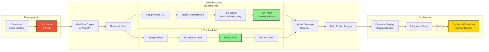

# CI/CD Pipeline

```mermaid
graph LR
    subgraph "Development"
        DEV[Developer<br/>Local Machine]
        GIT[Git Commit<br/>& Push]
    end

    subgraph "GitHub Actions"
        TRIGGER[Workflow Trigger<br/>on Push/PR]
        CHECKOUT[Checkout Code]
        
        subgraph "Backend Jobs"
            SETUP_PY[Setup Python 3.11]
            INSTALL_DEPS[Install Dependencies]
            LINT[Run Linters<br/>Black, Flake8, MyPy]
            TEST_BE[Run Pytest<br/>Coverage Report]
        end

        subgraph "Frontend Jobs"
            SETUP_NODE[Setup Node.js]
            INSTALL_NPM[Install pnpm deps]
            BUILD_FE[Next.js Build]
            LINT_FE[ESLint Check]
        end

        COVERAGE[Upload Coverage<br/>Codecov]
        DOCKER_BUILD[Build Docker Images]
    end

    subgraph "Deployment"
        DEPLOY_STAGE[Deploy to Staging<br/>Railway/Render]
        TEST_INTEGRATION[Integration Tests]
        DEPLOY_PROD[Deploy to Production<br/>Railway/Render]
    end

    DEV --> GIT
    GIT --> TRIGGER
    TRIGGER --> CHECKOUT

    CHECKOUT --> SETUP_PY
    CHECKOUT --> SETUP_NODE

    SETUP_PY --> INSTALL_DEPS
    INSTALL_DEPS --> LINT
    LINT --> TEST_BE

    SETUP_NODE --> INSTALL_NPM
    INSTALL_NPM --> BUILD_FE
    BUILD_FE --> LINT_FE

    TEST_BE --> COVERAGE
    LINT_FE --> COVERAGE

    COVERAGE --> DOCKER_BUILD
    DOCKER_BUILD --> DEPLOY_STAGE
    DEPLOY_STAGE --> TEST_INTEGRATION
    TEST_INTEGRATION -->|Success| DEPLOY_PROD

    style GIT fill:#f05032,stroke:#333,stroke-width:2px,color:#fff
    style TEST_BE fill:#90EE90,stroke:#333,stroke-width:2px
    style BUILD_FE fill:#90EE90,stroke:#333,stroke-width:2px
    style DEPLOY_PROD fill:#FFD700,stroke:#333,stroke-width:2px
```
