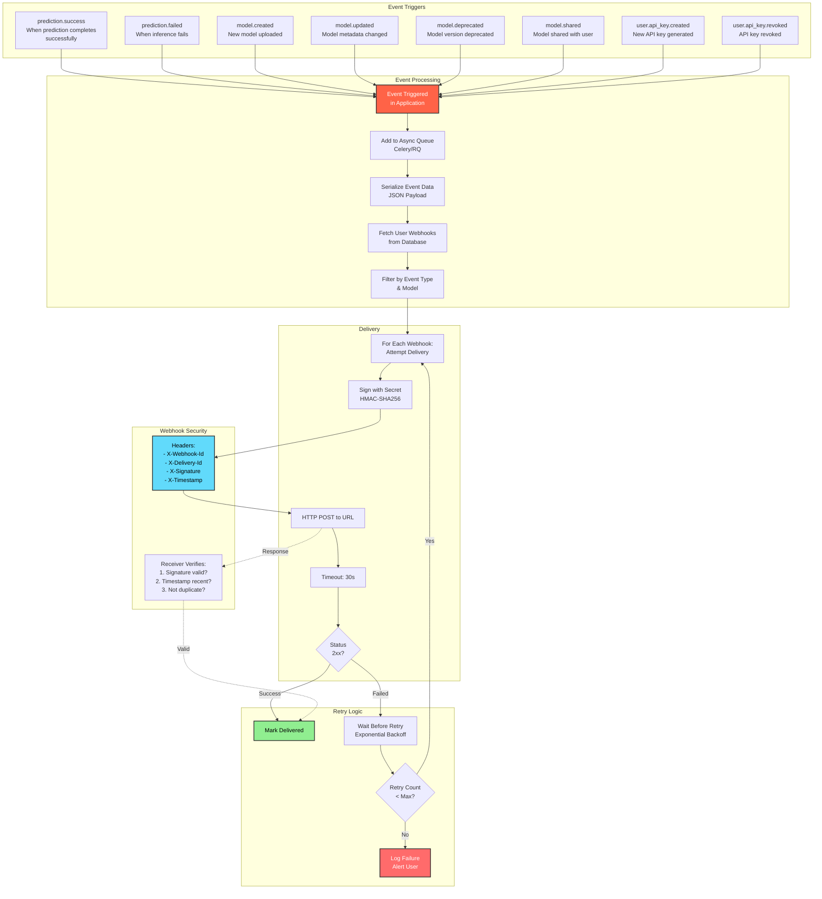

# Webhook Event Types & Delivery Flow

```mermaid
graph TB
    subgraph "Event Triggers"
        E1["prediction.success<br/>When prediction completes<br/>successfully"]
        E2["prediction.failed<br/>When inference fails"]
        E3["model.created<br/>New model uploaded"]
        E4["model.updated<br/>Model metadata changed"]
        E5["model.deprecated<br/>Model version deprecated"]
        E6["model.shared<br/>Model shared with user"]
        E7["user.api_key.created<br/>New API key generated"]
        E8["user.api_key.revoked<br/>API key revoked"]
    end

    subgraph "Event Processing"
        TRIGGER[Event Triggered<br/>in Application]
        QUEUE[Add to Async Queue<br/>Celery/RQ]
        SERIALIZE[Serialize Event Data<br/>JSON Payload]
        FETCH_WEBHOOKS[Fetch User Webhooks<br/>from Database]
        FILTER[Filter by Event Type<br/>& Model]
    end

    subgraph "Delivery"
        RETRY_LOOP["For Each Webhook:<br/>Attempt Delivery"]
        SIGN[Sign with Secret<br/>HMAC-SHA256]
        HTTP_POST[HTTP POST to URL]
        TIMEOUT["Timeout: 30s"]
        CHECK_STATUS{Status<br/>2xx?}
    end

    subgraph "Retry Logic"
        SUCCESS[Mark Delivered]
        RETRY_WAIT[Wait Before Retry<br/>Exponential Backoff]
        CHECK_RETRY{Retry Count<br/>< Max?}
        FAILED[Log Failure<br/>Alert User]
    end

    subgraph "Webhook Security"
        HEADERS["Headers:<br/>- X-Webhook-Id<br/>- X-Delivery-Id<br/>- X-Signature<br/>- X-Timestamp"]
        VERIFICATION["Receiver Verifies:<br/>1. Signature valid?<br/>2. Timestamp recent?<br/>3. Not duplicate?"]
    end

    E1 --> TRIGGER
    E2 --> TRIGGER
    E3 --> TRIGGER
    E4 --> TRIGGER
    E5 --> TRIGGER
    E6 --> TRIGGER
    E7 --> TRIGGER
    E8 --> TRIGGER

    TRIGGER --> QUEUE
    QUEUE --> SERIALIZE
    SERIALIZE --> FETCH_WEBHOOKS
    FETCH_WEBHOOKS --> FILTER
    FILTER --> RETRY_LOOP

    RETRY_LOOP --> SIGN
    SIGN --> HEADERS
    HEADERS --> HTTP_POST
    HTTP_POST --> TIMEOUT
    TIMEOUT --> CHECK_STATUS

    CHECK_STATUS -->|Success| SUCCESS
    CHECK_STATUS -->|Failed| RETRY_WAIT
    RETRY_WAIT --> CHECK_RETRY
    CHECK_RETRY -->|Yes| RETRY_LOOP
    CHECK_RETRY -->|No| FAILED

    HTTP_POST -.->|Response| VERIFICATION
    VERIFICATION -.->|Valid| SUCCESS

    style TRIGGER fill:#ff6347,stroke:#333,stroke-width:2px,color:#fff
    style SUCCESS fill:#90EE90,stroke:#333,stroke-width:2px,color:#000
    style FAILED fill:#ff6b6b,stroke:#333,stroke-width:2px,color:#fff
    style HEADERS fill:#61dafb,stroke:#333,stroke-width:2px,color:#000
```
